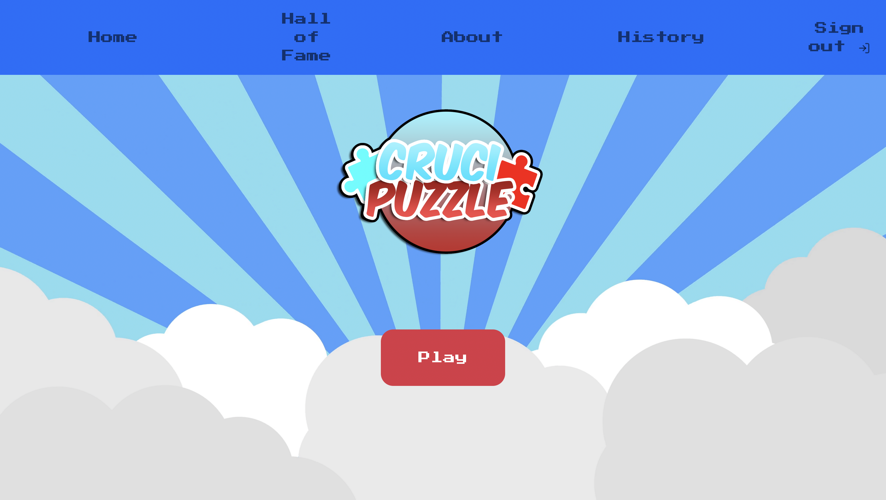
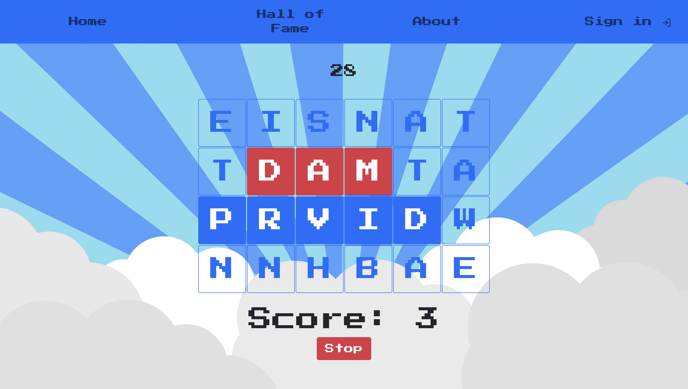

# Exam #5: "Web Application I"
## Student: s304661 MIRARCHI GIOVANNI

## React Client Application Routes

- Route  `/`: Home Page
- Route  `/about`: Just two words about the game
- Route  `/history` : If logged, here the user can look at all the past played match (if not logged redirect on `/` )
- Route  `/difficulty`: Game difficulty selection
- Route  `/play/:difficulty`: Start game with one of the possible level (_beginner_, _rookie_, _intermediate_, _command_ and _god_)
- Route  `/login`: Login page 
- Route  `/logout`: Logout page
- Route  `/hall-of-fame`: Hall of fame page

## API Server

- POST `/api/session` login
  - The request body contains email and password
  - response body contains user id, username and email, also a sessionID through cookies is provided
- GET `/api/play/:level` game start
  - `:level` parameter is the level difficulty based on description (beginner, rookie, intermediate...)
  - response body contains a matrix with game letters
- GET `/api/play` check found word
  - The request take a query param called `word` containing the word found in the game
  - response body contains a json object with `valid` setted at `true`\\`false` (it depends if the word is in the dictionary) and `score` that contains the score for that word (that is equal to `word.length`)
- POST `/api/insert-score` used to store score of signed user
  - The request take a body that contains username, score, id and date
  - The server response with status 201 if ok, 400 else
- DELETE `/session/end` logout
  - The server response with status 200 OK. 
- GET `/ranking`
  - The server returns the first 5 top score, is an array containing objects with id, username, user_id, score and date
- GET `/history`
  - The request take two query params `page` and `size`
  - The server returns an array of the first `size` elements from db with an offset of `page*size` elements, filtered by user_id (retrieved by session)

## Database Tables

- Table `USERS` - contains id, USERNAME, PASSWORD, EMAIL
- Table `GAMES` - store the game history of all signed player and contains id, username, score, user_id(FK), date
- Table `DIFFICULTY` - store the grid size based on difficulty level and contains id, description, height, length

## Main React Components

- `GameGrid` (in `src/compontens/grid/GameGrid.js`): this component is delegated to create all the game environment, maintains score, time, found words and all game logic, at the end of the game it do a fetch request to insert score on db (only if the user is logged)
- `HallOfFame` (in `src/components/pages/HallOfFame.js`): it is delegated to fetch data from db and show it on UI
- `About` (in `src/components/pages/About.js`): show some text about this project
- `MyNavbar` (in `scr/components/MyNavbar.js`): create the navbar used for site navigation
- `DifficultyModal`, `LoginModal`, `LogoutModal` and `ErrorModal` (in `src/components/modals/`): DifficultyModal appear when the user click on "Play" buttom, used to choose the game difficulty, LoginModal and LogoutModal are used for login and logout respectively, ErrorModal is shown when some error occurred (e.g. server down)

## Screenshots

 

## Users Credentials

| Email      | Password |
|------------|----------|
| test@crucipuzzle.it | test     |
| player@crucipuzzle.it | test     |
| test@test.it | test     |
| gamerx@test.it | test     |
| gamery@test.it | test     |
